# 概要设计

## 系统概述

StudyHub系统是一个计算机专业课一体化平台，从校园师生切身需求出发，集在线作业、在线考试、在线答疑等课程管理功能于一体的综合教学平台。

## 运行环境

### 软件环境

|            | **名称** | **版本**                               |
| ---------- | -------- | -------------------------------------- |
| 操作系统   | Windows  | 10                                     |
| 数据库平台 | MySql    | 8.0.24                                 |
| 应用平台   | Web      |                                        |
| 客户端软件 | Chrome   | 99.0.4844.82 (Official Build) (64-bit) |

### 硬件环境

xxxxxx

### 开发环境

xxxxxx

## 软件架构及说明（软件架构图）

xxxxxx

## 硬件架构及说明（网络拓扑图）

xxxxxx

## 关键技术与算法

说明本系统中的主要技术与算法。 

## 系统功能设计

下面主要对StudyHub各关键功能进行设计，描述其实现方式。除了文字描述以外，我们也绘制了类图、顺序图等辅助描述。 

### 物理视图（UML配置图） 

studyhub项目采用了前后端分离的设计，前端为用户返回界面，而后端提供json形式的数据。其中系统的数据（用户信息，作业考试记录、答疑记录等）保存在后端服务器的数据库中。具体如以下配置图所示： 

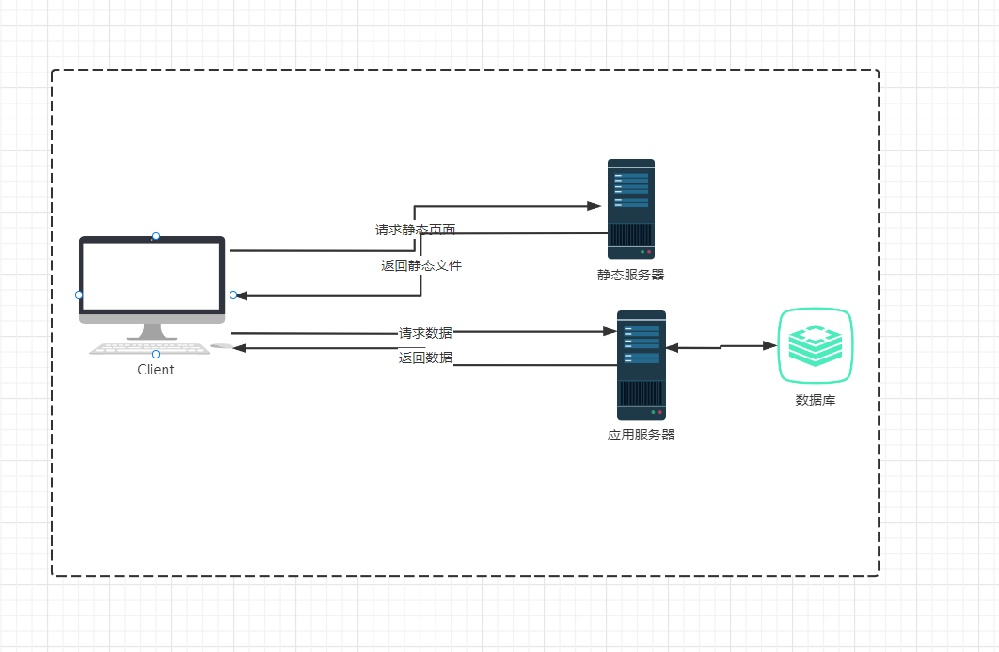

下面通过过程试图（包括UML中的状态图、顺序图、活动图），分四个模块来展示功能设计流程： 

### 用户信息模块 

首先是用户对个人信息的操作和管理，主要包括了用户登录功能，以及修改账号密码的功能。在这里我们认为用户首先需要输入正确的密码，才能对密码进行修改。具体见顺序图： 

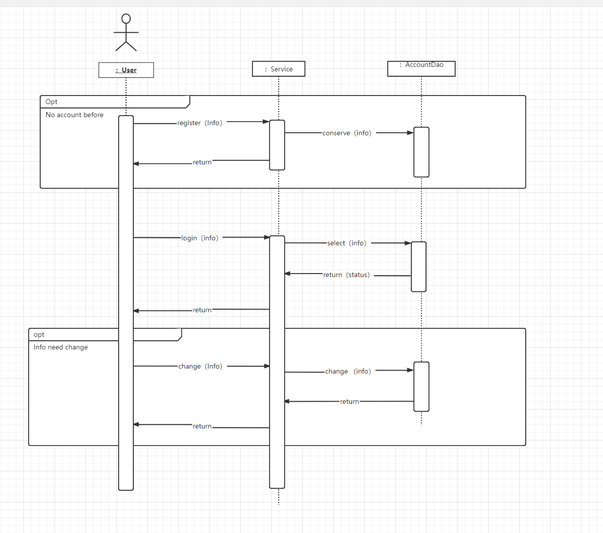 

用户修改的个人信息的状态图如下： 

### 作业模块 
作业模块的主要操作是老师布置作业，学生完成作业，老师批改作业，学生查看批改情况。系统在这个过程中主要作用是帮助存储老师以及学生对作业进行的编辑，以及通知学生完成作业，还有老师批改作业等。具体见以下状态图和活动图： 

作业模块状态图：

 

作业模块活动图：

### 考试模块 

作业模块的主要操作是老师设计试卷，学生在规定时间内完成考试，老师改卷，学生查看分数。系统在这个过程中主要作用是帮助存储老师以及学生对试卷进行的编辑，以及通知学生完成考试，还有老师及时改卷等。具体见以下状态图和活动图： 

考试模块状态图：

 

考试模块活动图: 

### 答疑论坛模块

答疑论坛模块的主要操作是学生针对作业中的题目提出问题，该问题会被发布到论坛上，老师看到后可以进行答疑。系统主要对学生的问题进行存储以及论坛上展示，同时还要记录答疑信息。具体见以下状态图和活动图： 

答疑论坛模块状态图：

 

答疑论坛模块活动图: 

### 期末汇总模块 

期末汇总模块是系统根据学生的考试情况自动生成的报告，老师可以在课头下查看，并下载到本地。具体见以下状态图和活动图： 

期末汇总模块状态图： 

 

期末汇总模块活动图： 

### 类图
StudyHub的逻辑视图部分我们采用类图来进行表示，主要包括以下几个部分：
 
(1)IssueSolveRecord部分： 

 
(2)Student部分： 

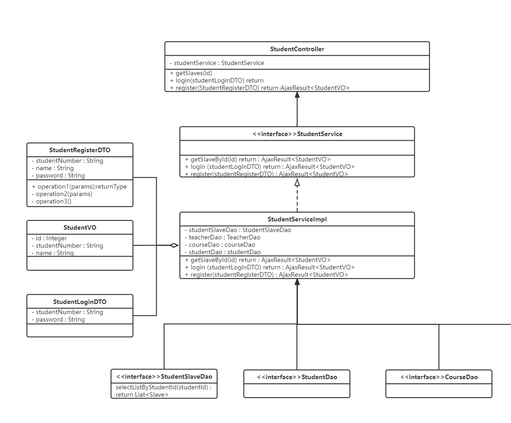 
(3)Teacher部分： 

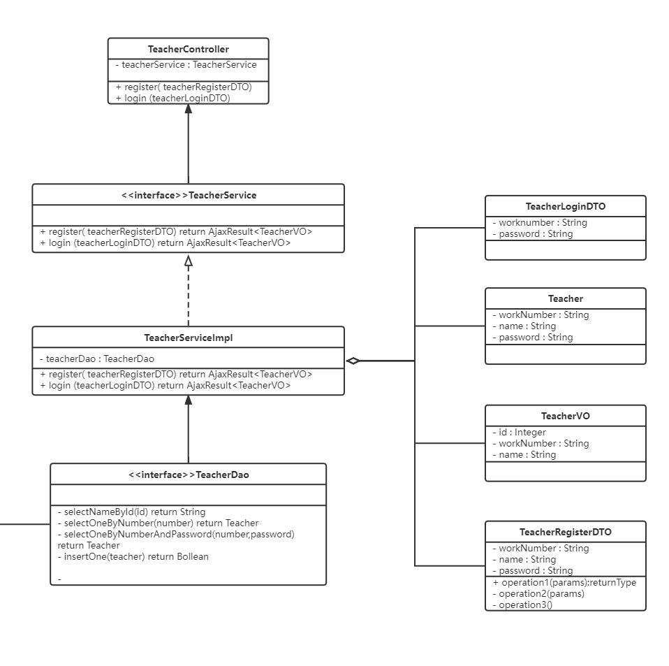 
(4)Assignment部分： 

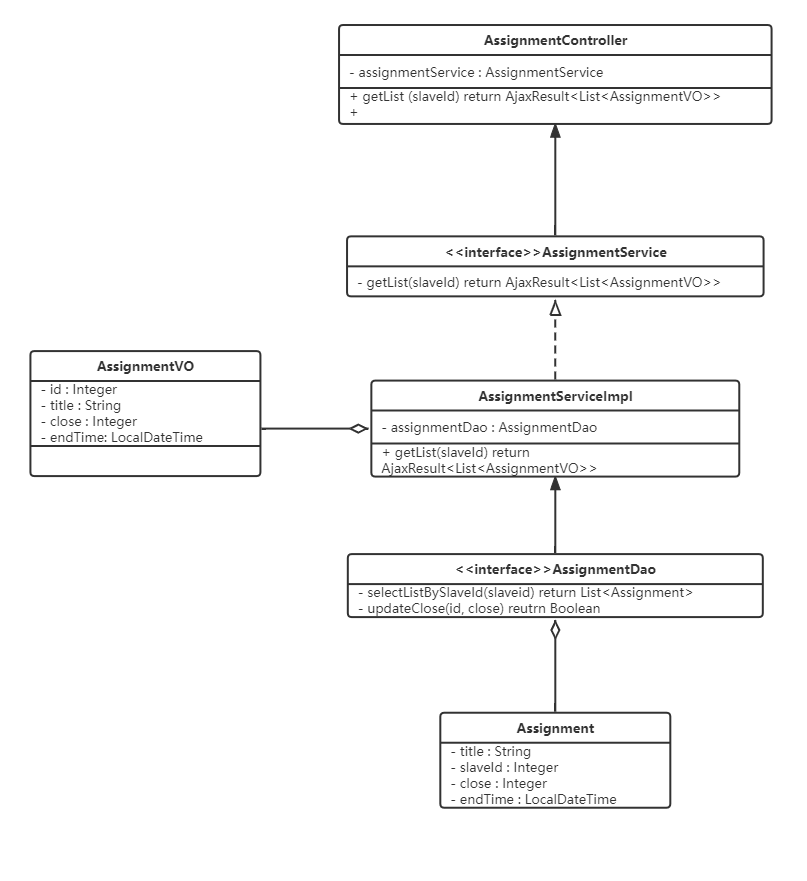 
(5)Issue部分： 

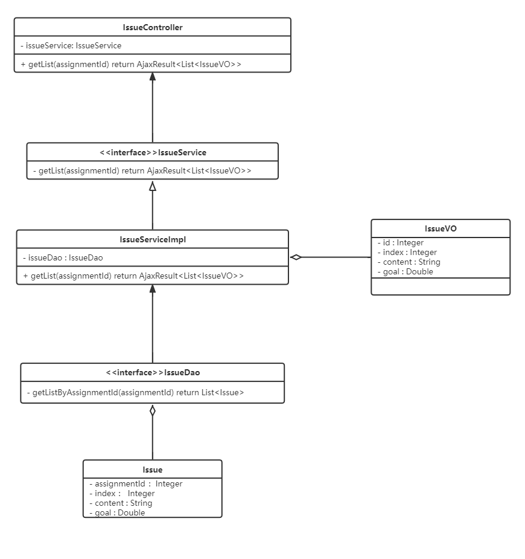 

### 开发视图 

使用UML构件图来表示模块，用包来表示子系统，利用连接表示模块或子系统之间的关联 

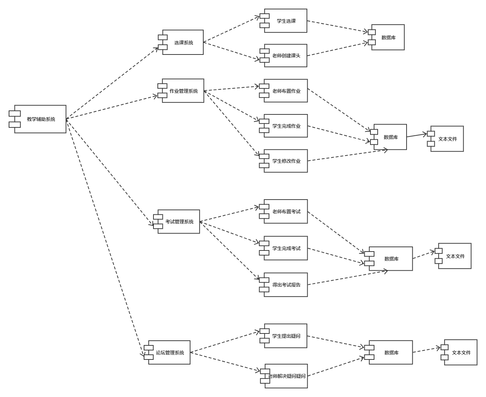 

## 非功能性设计

为保证满足非功能性指标，而采取的措施、技术等描述。

•性能：将关键性的操作局部化到少量的构件中、一台计算机上。减少通信量。
      对大量数据的处理优化算法
      对sql语句进行优化，命中索引
      使用Redis，消息队列等中间件进行缓存、异步等应对高并发。
•信息安全：层次化的体系结构，把最关键的资源放在最内层进行保护。
      对敏感信息在前后端进行加密处理和传输，有条件可以使用https。
      对用户进行身份验证、鉴权。

•可用性：在版本迭代时采取灰度发布、平滑上线功能。

•可维护性：尽量使用细粒度、自包含的构件，尽量避免共享数据结构。
      所有源码必须加上关键注释、不要过度注释。
      所有需求需要有单元测试。
      设计时尽量贴合高内聚低耦合。
•可靠性：为了避免服务不可用、服务器宕机，可以搭建集群。

## 数据库设计

### 采用的数据库

MYSQL 8.0.24

### 数据库表的设计

表的设计包括以下内容：

- 表名(中英文):
- 字段名:
- 字段数据类型：
- 字段是否为空：
- 字段的默认值：
- 备注，对字段的解释性说明：主键、外键、是否自动增一、是否为索引、是否唯一、是否进行数据检查等。主键是id，解释如下图

=======
作业表：assignment  
| 字段 | 数据类型 | 是否可空 | 默认值 | 备注 |  
| :---:| :---:   | :---:   | :---:  | :---: |   
| id   | int     |  0      |  自增  |  主键，自增1 |  
|title | varchar |  1      | null   |    标题  |
|slave_id |           int|       0|      无|         课头id|  
|close|               int|       0|       0|          1到期0未到期|  
|end_time|            datetime|  0|       无|         deadline|  
|delete|              int|       0|       0|          逻辑删除| 
|create_time|         datetime|  0|       当前时间戳|  插入时间| 
|update_time|         datetime|  0|       当前时间戳|  更新时间| 

课程表：course
| 字段 | 数据类型 | 是否可空 | 默认值 | 备注 |  
| :---:| :---:   | :---:   | :---:  | :---: |
|id|                  int|       0|       自增|       主键，自增1|
|name|                varchar|   1|       null|       名字|
|outline|             varchar|   1|       null|       大纲|
|delete|              int|       0|       0|          逻辑删除|
|create_time|         datetime|  0|       当前时间戳|  插入时间|
|update_time|         datetime|  0|       当前时间戳|  更新时间|

问题表: issue
| 字段 | 数据类型 | 是否可空 | 默认值 | 备注 |  
| :---:| :---:   | :---:   | :---:  | :---: |
|id|                  int|       0|       自增|       主键，自增1|
|assignment_id|       int|       0|       无 |        作业id|
|index|               int|       0|       无 | |       序号|
|content|             varchar|   1|       null |      内容|
|goal|                分值|      0|       0.0 |       分值|
|delete|              int|       0 |      0|          逻辑删除|
|create_time|         datetime|  0|       当前时间戳|  插入时间|
|update_time|         datetime|  0|       当前时间戳 | 更新时间|

问题解答记录表:issue_solve_record
| 字段 | 数据类型 | 是否可空 | 默认值 | 备注 |  
| :---:| :---:   | :---:   | :---:  | :---: |
|id             |     int   |    0    |   自增    |   主键，自增1|
|student_id    |      int  |     0   |    无    |     学生id|
|issue_id      |      int   |    0   |    无   |      问题id|
|content      |       varchar|   1   |    null  |     内容|
|correct      |       int   |    0   |    0     |     1已批改|
|score        |       double  |  0   |    -1.00 |     得分|
|delete       |       int    |   0  |     0      |    逻辑删除|
|create_time   |      datetime  |0  |     当前时间戳  |插入时间|
|update_time   |      datetime | 0  |     当前时间戳 | 更新时间|

课头表:slave
| 字段 | 数据类型 | 是否可空 | 默认值 | 备注 |  
| :---:| :---:   | :---:   | :---:  | :---: |
|id     |             int  |     0   |    自增  |     主键，自增1|
|slave_number |       varchar |  0  |     无  |       课头号|
|course_id    |       int  |     0   |    无   |      课程id|
|teacher_id   |       int  |     0  |     无   |      老师id|
|delete      |        int  |     0 |      0       |   逻辑删除|
|create_time   |      datetime | 0  |     当前时间戳 | 插入时间|
|update_time  |       datetime | 0  |     当前时间戳 | 更新时间|

学生表:student
| 字段 | 数据类型 | 是否可空 | 默认值 | 备注 |  
| :---:| :---:   | :---:   | :---:  | :---: |
id         |         int     |  0 |      自增   |    主键，自增1|
student_number|      varchar |  0  |     无    |     学号|
name                varchar   0  |     无    |     姓名|
password   |         varchar |  0  |     无     |    密码|
delete     |         int     |  0  |     0      |    逻辑删除|
create_time  |       datetime|  0    |   当前时间戳|  插入时间|
update_time  |       datetime | 0   |    当前时间戳 | 更新时间|

选课表:student_slave
| 字段 | 数据类型 | 是否可空 | 默认值 | 备注 |  
| :---:| :---:   | :---:   | :---:  | :---: |
id     |             int    |   0    |   自增   |    主键，自增1|
student_id |         int   |    0   |    无    |     学生id|
slave_id   |         int    |   0    |   无    |     课头id|
delete     |         int    |   0   |    0     |     逻辑删除|
create_time |        datetime | 0   |    当前时间戳  |插入时间|
update_time  |       datetime | 0   |    当前时间戳  |更新时间|

老师表:teacher
| 字段 | 数据类型 | 是否可空 | 默认值 | 备注 |  
| :---:| :---:   | :---:   | :---:  | :---: |
id       |           int    |   0    |   自增   |    主键，自增1|
work_number    |     varchar |  0   |    无   |      工号|
name        |        varchar |  0   |    无    |     姓名|
password     |       varchar |  0   |    无   |      密码|
delete       |       int     |  0   |    0       |   逻辑删除|
create_time  |       datetime  |0   |    当前时间戳 | 插入时间|
update_time  |       datetime | 0   |    当前时间戳 | 更新时间|

## 人机交互设计 
结合目前的开发进度，人机交互的展示我们主要通过原型图展示登录、课程列表、作业列表、作业编辑器四部分内容。具体内容在后续开发过程中持续更新

### 原型图

1、登录界面：
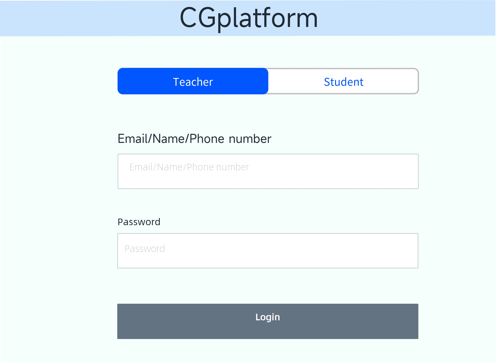

2、课程列表
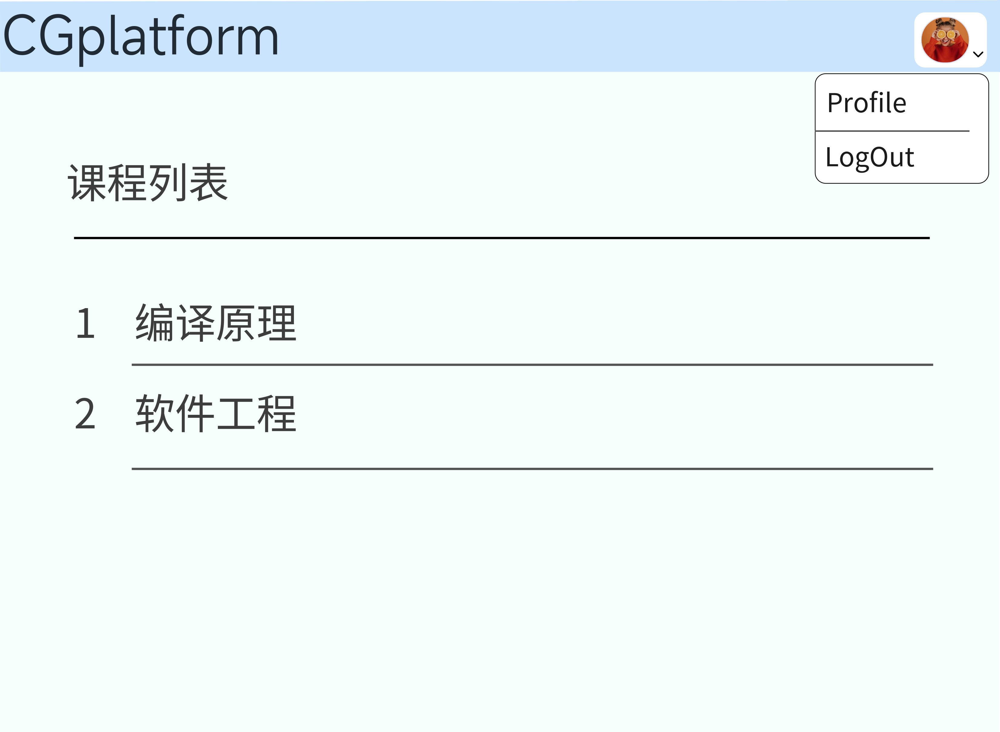

3、作业列表
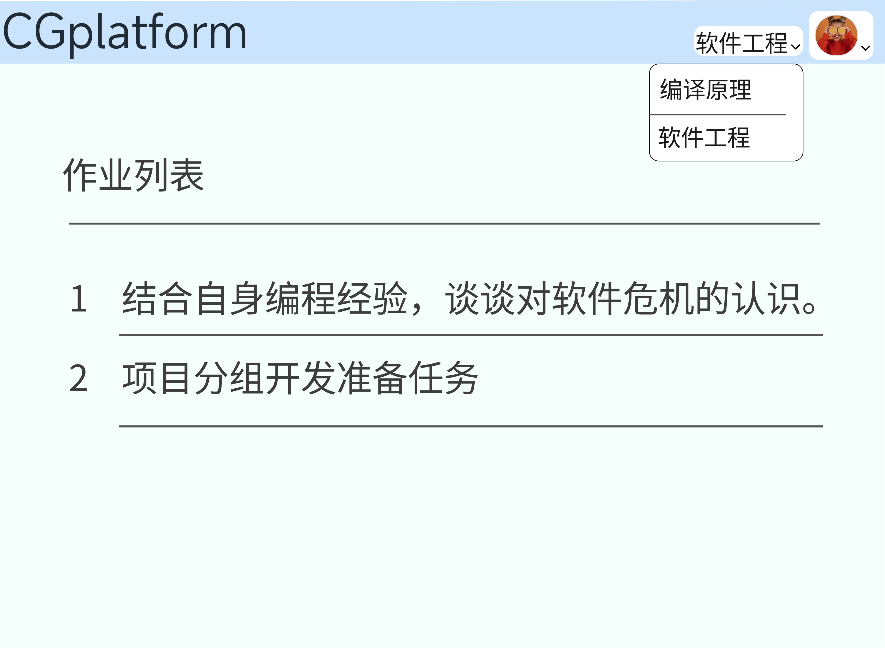

4、作业编辑器
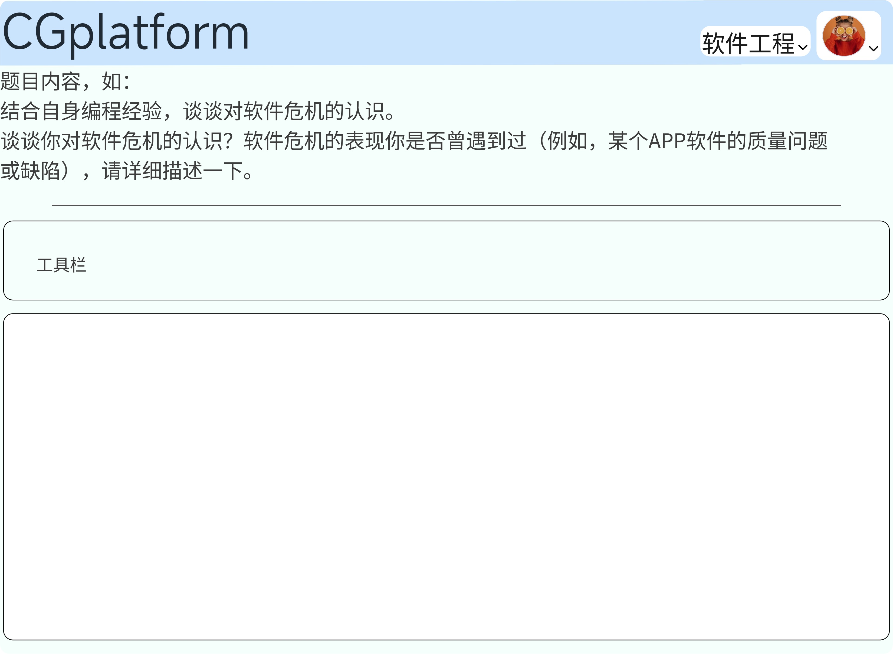

